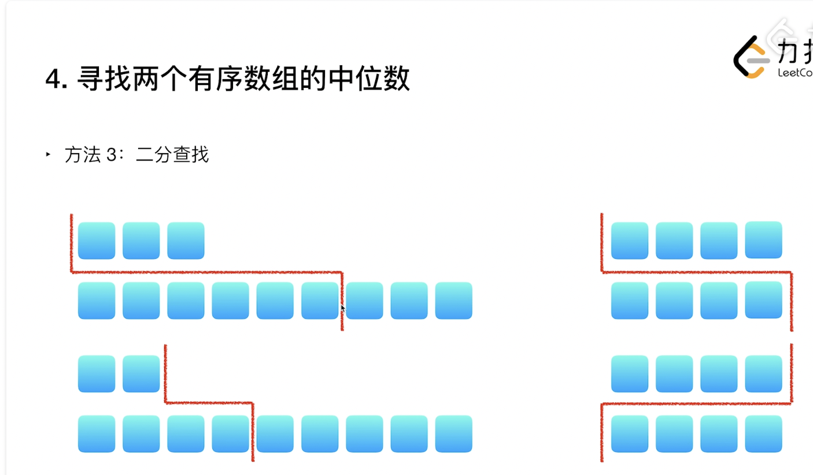

## 3 二分查找

### 3.1 搜索模板

* [AcWing](https://www.acwing.com/blog/content/31/)

```java
int l = 0, r = nums.length - 1;

//将区间分为[l, mid] 和 [mid + 1, r]
int binarySearch1(int l, int r) {
  	while(l < r) {
      	int mid = l + (r - l) / 2;
      	if(check(mid)) r = mid;
      	else l = mid + 1;
    }
  	return l;
}

//将区间分为[l, mid - 1] 和 [mid, r]
int binarySearch2(int l, int r) {
  	while(l < r) {
      int mid = (l + r + 1) / 2;//+1防止死循环，两数相加除以2是下取整，（1+2/2 =1,会死循环
      if(check(mid)) l = mid;
      else r = mid - 1;
    }
  return l;
}
```

> 写时候是看l=mid还是r=mid，如果l=mid，在mid处+1；


* [labuladong](https://mp.weixin.qq.com/s/M1KfTfNlu4OCK8i9PSAmug)

```java
int binarySearch(int[] nums, int target) {
    int left = 0, right = nums.length - 1; 
    while(left <= right) {
        int mid = left + (right - left) / 2;
        if (nums[mid] < target) {
            left = mid + 1;
        } else if (nums[mid] > target) {
            right = mid - 1; 
        } else if(nums[mid] == target) {
            // 直接返回
            return mid;
        }
    }
    // 直接返回
    return -1;
}

int leftBound(int[] nums, int target) {
    int left = 0, right = nums.length - 1;
    while (left <= right) {
        int mid = left + (right - left) / 2;
        if (nums[mid] < target) {
            left = mid + 1;
        } else if (nums[mid] > target) {
            right = mid - 1;
        } else if (nums[mid] == target) {
            // 别返回，锁定左侧边界
            right = mid - 1;
        }
    }
    // 最后要检查 left 越界的情况
    if (left >= nums.length || nums[left] != target)
        return -1;
    return left;
}


int rightBound(int[] nums, int target) {
    int left = 0, right = nums.length - 1;
    while (left <= right) {
        int mid = left + (right - left) / 2;
        if (nums[mid] < target) {
            left = mid + 1;
        } else if (nums[mid] > target) {
            right = mid - 1;
        } else if (nums[mid] == target) {
            // 别返回，锁定右侧边界
            left = mid + 1;
        }
    }
    // 最后要检查 right 越界的情况
    if (right < 0 || nums[right] != target)
        return -1;
    return right;
}
```


> labuladong的模板来说，寻找左右边界的情况，在具体题目中的体现不是特别明显(有的题目表述，你不知道需要查的左边界还是右边界)，有的时候理解不清可以在分别尝试一下左边界右边界（仅限笔试）


### 3.2 题目

**[Leetcode 15 三数之和](https://leetcode-cn.com/problems/3sum/)**

```java
class Solution {
    public List<List<Integer>> threeSum(int[] nums) {
        int len = nums.length;
        List<List<Integer>> res = new ArrayList<>();
        if(len < 3) return res;
        Arrays.sort(nums);
        for(int i = 0; i < len - 2; ++i) {
            if(i > 0 && nums[i] == nums[i - 1]) continue;
            int l = i + 1, r = len - 1;
            while(l < r) {
                int sum = nums[i] + nums[l] + nums[r];
                if(sum == 0) {
                    List<Integer> tmp = new ArrayList<>();
                    tmp.add(nums[i]);
                    tmp.add(nums[l]);
                    tmp.add(nums[r]);
                    res.add(tmp);
                    while(l < r && nums[l] == nums[++l]);
                    while(l < r && nums[r] == nums[--r]);
                }else if(sum < 0) {
                    while(l < r && nums[l] == nums[++l]);
                }else {
                    while(l < r && nums[r] == nums[--r]);
                }
            }
        }
        return res;
    }
}
```

> 这题很棒，我特别喜欢 :) 。
>
> * 排序后以左基点排序，之后后面区间二分查找。
> * 这道题要求不能包含重复点。去重这个写法太妙了。例如排序后的nums = [-4,-1,-1,0,1,2]，当 l = 1时，nums[l] = -1, nums[l + 1] = -1, nums[r] = 2, sum < 0, 需要将l右移，由于nums[i] == nums[i + 1] 重复，直接就把nums[l] 更新为新值0了。秒 ！ ;) 


* [AcWing二分讲解](https://www.bilibili.com/video/av35162983?from=search&seid=594453792093447226&spm_id_from=333.337.0.0)


#### 3.2.1 左右边界搜索

**[Leetcode 69 sqrt(x)](https://leetcode-cn.com/problems/sqrtx/)**

```java
class Solution {
    public int mySqrt(int x) {
        if(x < 2) return x;
        long l = 1, r = x;
        while(l < r) {
            long mid = l + (r - l + 1) / 2;
            long tmp = mid * mid;
            if(tmp > x) {
                r = mid - 1;
            }else if(tmp < x){
                l = mid;
            }else {
                return (int) mid;
            }
        }
        return (int)l;
    }
}


class Solution {
  public int mySqrt(int x) {
    long l = 0, r = x;
    while(l < r) {
      long mid = l + (r - l) / 2;
      long tmp = mid * mid;
      if(tmp >= x) r = mid;//这里是求大于等于x的上取整，而题目要求是下取整。所以做出更改
      else l = mid + 1;
    }
    return (int)l;
  }
}

class Solution {
  public int mySqrt(int x) {
    long l = 0, r = x;
    while(l < r) {
      long mid = l + (r - l + 1) / 2;
      long tmp = mid * mid;
      if(tmp <= x) l = mid;
      else r = mid - 1;
    }
    return (int)l;
  }
}
```

> 二分 === 魔鬼


**[Leetcode 34 排序数组目标值的左右边界 - Medium](https://leetcode-cn.com/problems/find-first-and-last-position-of-element-in-sorted-array/)**

```java
class Solution {
    private int searchLeft(int[] nums, int t) {
        int l = 0, r = nums.length - 1;
        while(l < r) {
            int mid = l + (r - l) / 2;
            if(nums[mid] >= t) r = mid;//当前值满足了，要找左端点，所以右半边排除
            else l = mid + 1;
        }
        return nums[l] == t ? l : -1;
    }
    
    private int searchRight(int[] nums, int t) {
        int l = 0, r = nums.length - 1;
        while(l < r) {
            int mid = l + (r - l + 1) / 2;
            if(nums[mid] <= t) l = mid;//当前值满足了，要找右端点，所以左半边排除
            else r = mid - 1;
        }
        return nums[r] == t ? r : -1;
    }
    
    public int[] searchRange(int[] nums, int t) {
        if(nums == null || nums.length == 0) return new int[]{-1, -1};
        int l = 0, r = nums.length - 1;
        int[] res = new int[2];
        res[0] = searchLeft(nums, t);
        if(res[0] == -1) res[1] = -1;
        else res[1] = searchRight(nums, t);
        return res;
    }
}


class Solution {
    public int[] searchRange(int[] nums, int target) {
        if(nums.length == 0 ) return new int[]{-1, -1};
        int[] res = new int[2];
        res[0] = binSearch(nums, target, true);
        res[1] = binSearch(nums, target, false);
        return res;
    }

    private int binSearch(int[] nums, int target, boolean leftOrRight){
        int left = 0, right = nums.length - 1;
        while(left <= right){
            int mid = left + (right - left) / 2;
            if(nums[mid] > target){
                right = mid - 1;
            }else if(nums[mid] < target){
                left = mid + 1;
            }else{
                if(leftOrRight){
                    right = mid - 1;//由于跳出条件，所以必须移动，否则死循环
                }else{
                    left = mid + 1;//同上
                }
            }
        }
        if(leftOrRight){
            if(left >= nums.length || nums[left] != target){
                return -1;
            }
            return left;
        }else{
            if(right < 0 || nums[right] != target){
                return -1;
            }
            return right;
        }        
    }
}
```

> 搜索左右边界的经典。
>
> 左边界就是第一个大于等于目标值的数
>
> 右边界就是最后一个小于等于目标的数，大于的肯定不对，所以先舍去右边。


**[Leetcode 35 搜索插入位置 - Easy](https://leetcode-cn.com/problems/search-insert-position/)**

```java
class Solution {
    public int searchInsert(int[] nums, int t) {
        int len = nums.length, l = 0, r = len - 1;
        if(nums[len - 1] < t) return len;
        while(l < r) {
            int mid = l + (r - l) / 2;
            if(nums[mid] >= t) r = mid;
            else l = mid + 1;
        }
        return l;
    }
}
```

> 本题是找第一个大于等于target的位置，由于右边界的定义问题，当target比nums中最大的数还大时，无法新增位置，故要加一个特判。

```java
class Solution {
    public int searchInsert(int[] nums, int t) {
        int len = nums.length, l = 0, r = len;
        while(l < r) {
            int mid = l + (r - l) / 2;
            if(nums[mid] >= t) r = mid;
            else l = mid + 1;
        }
        return l;
    }
}
```

> 直接在定义时将r定义为len。由于mid是向下取整，故mid不会越界。


 **[Leetcode 436 寻找右区间 - Medium](https://leetcode-cn.com/problems/find-right-interval/)**

```java
class Solution {
    private int binarySearch(int[] arr, int target) {
        int len = arr.length;
        if(arr[len - 1] < target) return -1;
        int l = 0, r = len - 1;
        while(l < r) {
            int mid = l + (r - l) / 2;
            if(arr[mid] >= target) r = mid;//同上，寻找第一个大于等于该值的点
            else l = mid + 1;
        }
        return l;
    }
    
    public int[] findRightInterval(int[][] intervals) {
        int len = intervals.length;
        if(len == 1) return new int[]{-1};
        Map<Integer, Integer> map = new HashMap<>();
        int[] arr = new int[len];
        for(int i = 0; i < len; ++i) {
            map.put(intervals[i][0], i);
            arr[i] = intervals[i][0];
        }
        Arrays.sort(arr);
        int[] res = new int[len];
        for(int i = 0; i < len; ++i) {
            int idx = binarySearch(arr, intervals[i][1]);
            if(idx == -1) res[i] = -1;
            else res[i] = map.get(arr[idx]);
        }
        return res;
    }
}
```

> 找第一个大于等于目标值的点，**反过来看，小于该值的区间必然不需要**   <- 666666

```java
class Solution {    
    public int[] findRightInterval(int[][] intervals) {
        int len = intervals.length;
        if(len == 0) return new int[0];
        TreeMap<Integer, Integer> map = new TreeMap<>();
        for(int i = 0; i < len; ++i) map.put(intervals[i][0], i);
        int[] res = new int[len];
        for(int i = 0; i < len; ++i) {
            Map.Entry<Integer, Integer> entry = map.ceilingEntry(intervals[i][1]);
            if(entry == null) res[i] = -1;
            else res[i] = entry.getValue();
        }
        return res;
    }
}
```

> TreeMap做法


#### 3.2.2 旋转有序数组搜索


**[Leetcode 33 搜索旋转排序数组 - Medium](https://leetcode-cn.com/problems/search-in-rotated-sorted-array/)**

```java
class Solution {
    public int search(int[] nums, int target) {
        int l = 0, r = nums.length - 1;
        while(l < r) {
            int mid = l + (r - l) / 2;
            if(nums[mid] == target) return mid;
            if(target > nums[r]) {
                if(nums[mid] > nums[r]) {
                    if(nums[mid] > target) {
                        r = mid - 1;
                    }else {
                        l = mid + 1;
                    }
                }else {
                    r = mid - 1;
                }
            }else if(target < nums[r]) {
                if(nums[mid] < nums[r]) {
                    if(nums[mid] > target) {
                        r = mid - 1;
                    }else {
                        l = mid + 1;
                    }
                }else {
                    l = mid + 1;
                }
            }else return r;
        }
        return nums[l] == target ? l : -1;
    }
}
```

> 分别根据target，nums[mid], 与nums[r]的关系，来确定位于左半段还是右半段。


**[Leetcode 81 搜索旋转排序数组 II - Medium](https://leetcode-cn.com/problems/search-in-rotated-sorted-array-ii/)**

```java
class Solution {
    public boolean search(int[] nums, int target) {
        int len = nums.length, l = 0, r = len - 1;
        while(l < r) {
            int mid = l + (r - l) / 2;
            if(nums[mid] == target) return true;
            if(target > nums[r]) {
                if(nums[mid] > nums[r]) {
                    if(target > nums[mid]) {
                        l = mid + 1;
                    }else {
                        r = mid - 1;
                    }
                }else if(nums[mid] < nums[r]) {
                    r = mid - 1;
                }else {
                    --r;//**当nums[mid] == nums[r]时，边界左移。
                }
            }else if(target < nums[r]) {
                if(nums[mid] > nums[r]) {
                    l = mid + 1;
                }else if(nums[mid] < nums[r]) {
                    if(target > nums[mid]) {
                        l = mid + 1;
                    }else {
                        r = mid - 1;
                    }
                }else {
                    --r;//**
                }
            }else return true;
        }
        return nums[l] == target;//由于找到即退出，需要确定最后的值是否是target
    }
}
```

> 当nums[mid] == nums[r]时，由于每次比较都是以右边界作为基准，现在和基准值相同，反而不知道nums[mid]是位于左半边还是右半边了。
>
> 这时候，将r--，10111，这种mid在右边界，如果mid在右边界，那么mid和r之间必然全是相等的值，r--不影响结果；
>
> 11101,这种mid在左边界，mid和r之间一定有小于nums[r]的值，那么去掉后继续确定其余点就好了。


**[Leetcode 153 寻找旋转排序数组中的最小值- Medium](https://leetcode-cn.com/problems/find-minimum-in-rotated-sorted-array/)**

```java
class Solution {
    public int findMin(int[] nums) {
        int l = 0, r = nums.length - 1;
        while(l < r) {
            int mid = l + (r - l) / 2;
            if(nums[mid] > nums[r]) l = mid + 1;//1
            else r = mid; //2
        }
        return nums[l];
    }
}
```

> 如果旋转偶数次，则一直走第二种情况，最后输出nums[0];
>
> 如果旋转奇数次，则先过渡到右半边，然后再走第二种情况，最后输出nums[min];


**[Leetcode 154 寻找旋转排序数组中的最小值II - Hard](https://leetcode-cn.com/problems/find-minimum-in-rotated-sorted-array-ii/)**

```java
class Solution {
    public int findMin(int[] nums) {
        int l = 0, r = nums.length - 1;
        while(l < r) {
            int mid = l + (r - l) / 2;
            if(nums[mid] > nums[r]) {
                l = mid + 1;
            }else if(nums[mid] < nums[r]) {
                r = mid;
            }else --r;
        }
        return nums[l];
    }
}
```

> 和上文思路雷同


#### 3.2.3 其他

**[Leetcode 540 有序数组中的单一元素 - Medium](https://leetcode-cn.com/problems/single-element-in-a-sorted-array/)**

```java
class Solution {
    public int singleNonDuplicate(int[] nums) {
        int l = 0, r = nums.length - 1;
        while(l < r) {
            int tmp = l + (r - l) / 2;
            int mid = tmp % 2 == 0 ? tmp : tmp - 1;
            if(nums[mid] == nums[mid + 1]) l = mid + 2;
            else r = mid;
        }
        return nums[l];
    }
}
```

> 单一元素只能出现在偶数位
>
> 另外这个tmp - 1 换成tmp + 1就会死循环
>
> 🌰：[1,1,2,3,3,4,4,8,8]  最后区间为[1,1,2],如果条件是tmp + 1，那么mid = 2，r最后还是2，死循环。
>
> 如果是tmp - 1，由于/ 2的向下取整特性，可以保证mid + 1，必定是[l, r]区间内的值，所以可以跳出循环。


**[Leetcode 4 寻找两个正序数组的中位数 - Hard](https://leetcode-cn.com/problems/median-of-two-sorted-arrays/)**

```java
class Solution {
    public double findMedianSortedArrays(int[] nums1, int[] nums2) {
        if(nums1.length > nums2.length) {
            int[] tmp = nums1;
            nums1 = nums2;
            nums2 = tmp;
        }
        int m = nums1.length, n = nums2.length;
        int totalLeft = (m + n + 1) / 2;
        //如果m+n为偶数，+1不影响，如果m+n为奇数，让左边多一个数。+1实现奇偶逻辑统计
        
        //在nums1的[0,m]区间内寻找分割线
        //i表示nums1分割线右边第一个元素的下标，也即nums1中分割线左边元素的个数
        //j表示nums2分割线右边第一个元素的下标，也即nums2中分割线左边元素的个数
        //i + j = totalLeft;
        //使得nums1[i - 1] <= nums2[j] * && nums2[j - 1] <= nums1[i] **  ----***
        int l = 0, r = m;
        while(l < r) {
            int i = l + (r - l + 1) / 2;
            int j = totalLeft - i;
            
            //当不满足***条件时，指针移动，***取反，即可以*取反 || **取反
            //因为i和j满足等式关系，所以只选其中一个取反即可，这里选择*取反
            if(nums1[i - 1] > nums2[j]) {
                //下一轮搜索区间是[l, i - 1];
                r = i - 1;//这里是i - 1而不是i - 2，是因为最后返回的是i的坐标。
            }else {
                l = i;//这里会造成死循环，更改上面i的表达式为 i = l + (r - l + 1) / 2
                //由于i改了表达式，所以i不可能为0，所以nums[i - 1]不会越界
            }
        }
        int i = l;
        int j = totalLeft - i;
        int nums1LeftMax  = i == 0 ? Integer.MIN_VALUE : nums1[i - 1];
        int nums1RightMin = i == m ? Integer.MAX_VALUE : nums1[i];
        int nums2LeftMax  = j == 0 ? Integer.MIN_VALUE : nums2[j - 1];
        int nums2RightMin = j == n ? Integer.MAX_VALUE : nums2[j];
        
        if((m + n) % 2 == 1) {
            return (double)Math.max(nums1LeftMax, nums2LeftMax);
        }else {
            return (double)(Math.max(nums1LeftMax, nums2LeftMax) + Math.min(nums1RightMin, nums2RightMin)) / 2.0;
        }
    }
}
```

```java
class Solution {
    public double findMedianSortedArrays(int[] nums1, int[] nums2) {
        if(nums1.length > nums2.length) {
            int[] tmp = nums1;
            nums1 = nums2;
            nums2 = tmp;
        }
        int m = nums1.length, n = nums2.length;
        int totalLeft = (m + n + 1) / 2;
        //如果m+n为偶数，+1不影响，如果m+n为奇数，让左边多一个数。+1实现奇偶逻辑统计
        
        //在nums1的[0,m]区间内寻找分割线
        //i表示nums1分割线右边第一个元素的下标，也即nums1中分割线左边元素的个数
        //j表示nums2分割线右边第一个元素的下标，也即nums2中分割线左边元素的个数
        //i + j = totalLeft;
        //使得nums1[i - 1] <= nums2[j] * && nums2[j - 1] <= nums1[i] **  ----***
        int l = 0, r = m;
        while(l < r) {
            int i = l + (r - l) / 2;
            int j = totalLeft - i;
            
            //当不满足***条件时，指针移动，***取反，即可以*取反 || **取反
            //因为i和j满足等式关系，所以只选其中一个取反即可，这里选择*取反
            if(nums2[j - 1] > nums1[i]) {
                //下一轮搜索区间是[i + 1, r];
                l = i + 1;
            }else {
                r = i;//这里不会造成死循环，更改上面i的表达式为 i = l + (r - l) / 2
                //由于i是下取整，所以i不可能取到m，所以nums[i]不会越界。由于i不为m，所以j不可能为0
            }
        }
        int i = l;
        int j = totalLeft - i;
        int nums1LeftMax  = i == 0 ? Integer.MIN_VALUE : nums1[i - 1];
        int nums1RightMin = i == m ? Integer.MAX_VALUE : nums1[i];
        int nums2LeftMax  = j == 0 ? Integer.MIN_VALUE : nums2[j - 1];
        int nums2RightMin = j == n ? Integer.MAX_VALUE : nums2[j];
        
        if((m + n) % 2 == 1) {
            return (double)Math.max(nums1LeftMax, nums2LeftMax);
        }else {
            return (double)(Math.max(nums1LeftMax, nums2LeftMax) + Math.min(nums1RightMin, nums2RightMin)) / 2.0;
        }
    }
}
```



>  广义分割线，将两个数组划分为两部分，左部 <= 右部。时间复杂度为O(log(min(m, n))).


