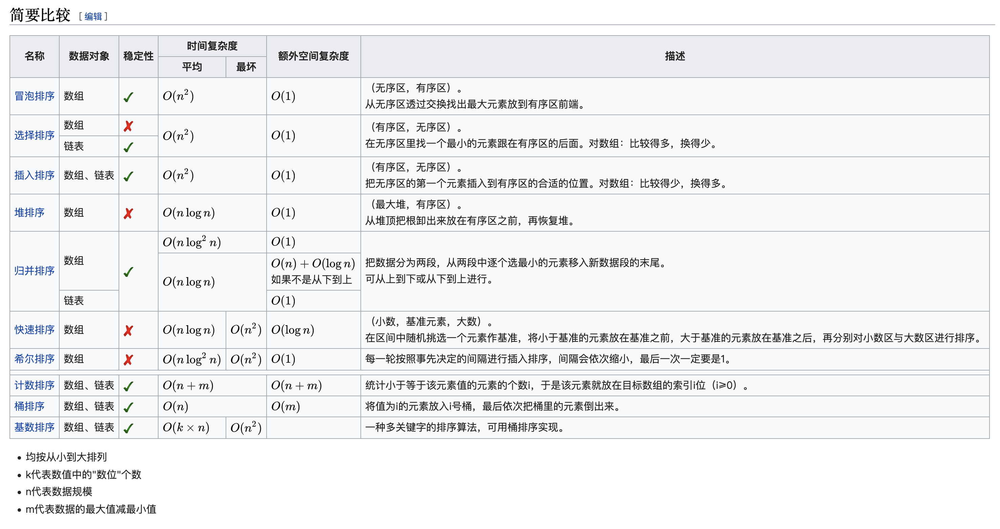

## 排序算法

**[排序总结](https://www.cnblogs.com/onepixel/p/7674659.html)**




### 4.1排序实现

```java
//冒泡排序
public void bubbleSort(int[] nums) {
  int len = nums.length;
  for(int i = 0; i < len - 1; ++i) {
    for(int j = i + 1; j < len; ++j) {
      if(nums[j] > nums[j + 1]) {
        swap(nums, j, j + 1);
      }
    }
  }
}
```

```java
// 插入排序：稳定排序，在接近有序的情况下，表现优异
public int[] sortArray(int[] nums) {
  	int len = nums.length;
	  // 循环不变量：将 nums[i] 插入到区间 [0, i) 使之成为有序数组
  	for (int i = 1; i < len; i++) {
    	// 先暂存这个元素，然后之前元素逐个后移，留出空位
	    int temp = nums[i];
  	  int j = i;
    	// 注意边界 j > 0
	    while (j > 0 && nums[j - 1] > temp) {
  	  	  nums[j] = nums[j - 1];
    	  	j--;
	    }
  	  nums[j] = temp;
  	}
	  return nums;
}
//在数组长度小时，使用插入排序效率高，比如数组长度小于等于7时。
```


```java
//快速排序
    private void swap(int[] nums, int x, int y) {
        int tmp = nums[x];
        nums[x] = nums[y];
        nums[y] = tmp;
    }

    private int partition(int[] nums, int l, int r) {
        int pivot = nums[l];//数据量特别大时，这里可以用random取，保证平均时间复杂度为O(nlogn)
        int pivotIdx = l;
        for(int i = pivotIdx + 1; i <= r; ++i) {
            if(nums[i] < pivot) {
                swap(nums, i, pivotIdx + 1);
                ++pivotIdx;
            }
        }
        swap(nums, l, pivotIdx);
        return pivotIdx;
    }

    public void quickSort(int[] nums, int l, int r) {
        if(l >= r) return;
        int pivotIdx = partition(nums, l, r);
        quickSort(nums, l, pivotIdx - 1);
        quickSort(nums, pivotIdx + 1, r);
    }

```

```java
//堆排序
private void swap(int[] tree, int x, int y) {
  	int tmp = tree[x];
  	tree[x] = tree[y];
  	tree[y] = tmp;
}

private void heapify(int[] tree, int n, int i) {
  	if(i >= n) return;
  	//n代表树的节点数，i表示从节点i开始向下进行heapify
	  int c1 = 2 * i + 1, c2 = 2 * i + 2;
  	int max = i;
  	if(c1 < n && tree[c1] > tree[max]) max = c1;
  	if(c2 < n && tree[c1] > tree[max]) max = c2;
  	if(max != i) {
    		swap(tree, i, max);
      	heapify(tree, n, max);
  	}
}

private void buildHeap(int[] tree, int n) {
  	int lastNode = n - 1;
  	int parentNode = (lastNode - 1) / 2;
  	for(int i = parentNode; i >= 0; --i) {
      	heapify(tree, n, i);
    }
}

public void heapSort(int[] tree, int n) {
  	buildHeap(tree, n);
  	for(int i = n - 1; i >= 0; --i) {
      	swap(tree, i, 0);
      	heapify(tree, i, 0);
    }
}
//建堆之后，每次取最大值，然后堆的大小-1。
```

​	

```java
//归并排序

private void mergeOfTwoSortedArray(int[] nums, int[] tmp, int l, int mid, int r) {
  	System.arraycopy(nums, l, tmp, l, r - l + 1);
  
  	int i = l, j = mid + 1;
  	for(int k = l; k <= r; ++k) {
      	if(i == mid + 1) {
          	nums[k] = tmp[j++];
        }else if(j == r + 1) {
          	nums[k] = tmp[i++];
        }else if(tmp[i] <= tmp[j]) {//等于号保证了稳定性
          	nums[k] = tmp[i++];
        }else {
          	nums[k] = tmp[j++];
        }
    }
}

public void mergeSort(int[] nums, int[] tmp, int l, int r) {
  	if(l >= r) return;
  	int mid = (l + r) >>> 1;
  	mergeSort(nums, tmp, l, mid);
  	mergeSort(nums, tmp, mid + 1, r);
  	if(nums[mid] < nums[mid + 1]) return;//数组已经有序则返回
  	mergeOfTwoSortedArray(nums, tmp, l, mid, r);
}

public void sortArray(int[] nums) {
  	int len = nums.length;
  	int[] tmp = new int[len];
  	mergeSort(nums, tmp);
}
```


### 4.2 题目


**[Leetcode 215 数组中第k个最大元素](https://leetcode-cn.com/problems/kth-largest-element-in-an-array/)**

```java
//堆1--y优先队列
class Solution {
    public int findKthLargest(int[] nums, int k) {
        PriorityQueue<Integer> pq = new PriorityQueue<>(k);
        for(int i = 0; i < k; ++i) {
            pq.offer(nums[i]);
        }
        for(int i = k; i < nums.length; ++i) {
            if(nums[i] > pq.peek()) {
                pq.poll();
                pq.offer(nums[i]);
            }
        }
        return pq.peek();
    }
}

//堆2--手动建堆
class Solution {
    private void swap(int[] nums, int x, int y) {
            int tmp = nums[x];
            nums[x] = nums[y];
            nums[y] = tmp;
        }
        
    private void heapify(int[] nums, int n, int i) {
        int c1 = 2 * i + 1, c2 = 2 * i + 2;
        int min = i;
        if(c1 < n && nums[c1] < nums[min]) min = c1;
        if(c2 < n && nums[c2] < nums[min]) min = c2;
        if(min != i) {
            swap(nums, min, i);
            heapify(nums, n, min);
        }
    }

    private void buildHeap(int[] nums, int n) {
        int lastNode = n - 1;
        int parentNode = (lastNode - 1) >> 1;
        for(int i = parentNode; i >= 0; --i) {
            heapify(nums, n, i);
        }
    }
    
    public int findKthLargest(int[] nums, int k) {
        buildHeap(nums, k);
        for(int i = nums.length - 1; i >= k; --i) {
            if(nums[i] > nums[0]) {
                swap(nums, i, 0);
                heapify(nums, k, 0);
            }
        }
        return nums[0];
    }
}

//partition
class Solution {
    private Random rd = new Random();
    
    private void swap(int[] nums, int x, int y) {
        int tmp = nums[x];
        nums[x] = nums[y];
        nums[y] = tmp;
    }
    
    private int partition(int[] nums, int l, int r) {
        if(r > l) {
            int randomIdx = l + 1 + rd.nextInt(r - l);
            swap(nums, l, randomIdx);
        }
        int pivot = nums[l];
        int pivotIdx = l;
        for(int i = l + 1; i <= r; ++i) {
            if(nums[i] < pivot) {
                ++pivotIdx;
                swap(nums, i, pivotIdx);
            }
        }
        swap(nums, pivotIdx, l);
        return pivotIdx;
    }
    
    public int findKthLargest(int[] nums, int k) {
        int len = nums.length;
        int l = 0, r = len - 1;
        int target = len - k;
        while(true) {
            int idx = partition(nums, l, r);
            if(idx == target) return nums[idx];
            else if(idx < target) {
                l = idx + 1;
            }else {
                r = idx - 1;
            }
        }
    }
}
```

> partition方法利用主定理推导，可以达到O(n)的时间复杂度。在遇到极端用例时（如正序或逆序数组），递归树会退化成链表，达到O(n^2)的时间复杂度，利用随机化，可以避免递归树进一步加深。


**[Leetcode 347 前k个高频元素 - Medium](https://leetcode-cn.com/problems/top-k-frequent-elements/)**

```java
//大顶堆，O(nlogn)
class Solution {
    public int[] topKFrequent(int[] nums, int k) {
        Map<Integer, Integer> map = new HashMap<>();
        for(int num : nums) map.put(num, map.getOrDefault(num, 0) + 1);
        PriorityQueue<int[] > pq = new PriorityQueue<>((a, b) -> b[1] - a[1]);
        for(Map.Entry<Integer, Integer> entry : map.entrySet()) {
            pq.offer(new int[]{entry.getKey(), entry.getValue()});
        }
        int[] res = new int[k];
        for(int i = 0; i < k; ++i) {
            res[i] = pq.poll()[0];
        }
        return res;
    }
}

//小顶堆，O(nlogk)
class Solution {
    public int[] topKFrequent(int[] nums, int k) {
        Map<Integer, Integer> map = new HashMap<>();
        for(int num : nums) map.put(num, map.getOrDefault(num, 0) + 1);
        PriorityQueue<Integer> pq = new PriorityQueue<>(k, (a, b) -> map.get(a) - map.get(b));
        for(Integer key : map.keySet()) {
            if(pq.size() < k) pq.offer(key);
            else if(map.get(key) > map.get(pq.peek())) {
                pq.poll();
                pq.offer(key);
            }
        }
        
        int[] res = new int[k];
        for(int i = 0; i < k; ++i) {
            res[i] = pq.poll();
        }
        return res;
    }
}

//桶排序，O(n)
class Solution {
    public int[] topKFrequent(int[] nums, int k) {
        Map<Integer, Integer> map = new HashMap<>();
        for(int num : nums) map.put(num, map.getOrDefault(num, 0) + 1);
        List<Integer>[] list = new List[nums.length + 1];
        for(int key : map.keySet()) {
            int i = map.get(key);
            if(list[i] == null) list[i] = new ArrayList<>();
            list[i].add(key);
        }
        int[] res = new int[k];
        int cnt = 0;
        for(int i = list.length - 1; i >= 0 && cnt < k; --i) {
            if(list[i] == null) continue;
            for(int j = list[i].size() - 1; j >= 0; --j) {
                res[cnt++] = list[i].get(j);
            }
        }
        return res;
    }
}
//按照频率分桶，倒序遍历放入答案数组。
```


**[Leetcode 451 根据字符出现的频率排序 - Medium](https://leetcode-cn.com/problems/sort-characters-by-frequency/)**

```java
//堆，构建类，存储不同类型数据。如果其他语言用元组就解决了。
class Solution {
    class Node {
        char c;
        int fre;
        public Node(char _c, int _fre) {
            c = _c;
            fre = _fre;
        }
    }
    
    public String frequencySort(String s) {
        Map<Character, Integer> map = new HashMap<>();
        for(char c : s.toCharArray()) map.put(c, map.getOrDefault(c, 0) + 1);
        PriorityQueue<Node> pq = new PriorityQueue<>((a, b) -> b.fre - a.fre);
        for(Map.Entry<Character, Integer> entry : map.entrySet()) {
            pq.offer(new Node(entry.getKey(), entry.getValue()));
        }
        StringBuilder sb = new StringBuilder();
        while(!pq.isEmpty()) {
            Node poll = pq.poll();
            int fre = poll.fre;
            char c = poll.c;
            for(int i = 0; i < fre; ++i) {
                sb.append(c);
            }
        }
        return sb.toString();
    }
}

//桶排序，统计最大频率，作为分桶标准。
class Solution {
    public String frequencySort(String s) {
        Map<Character, Integer> map = new HashMap<>();
        int maxFreq = 0;
        for(char c : s.toCharArray()) {
            int freq = map.getOrDefault(c, 0) + 1;
            map.put(c, freq);
            maxFreq = Math.max(maxFreq, freq);
        }
        List<Character>[] buckets = new List[maxFreq + 1];
        for(Character key : map.keySet()) {
            int i = map.get(key);
            if(buckets[i] == null) buckets[i] = new ArrayList<>();
            buckets[i].add(key);
        }
        StringBuilder sb = new StringBuilder();
        for(int i = buckets.length - 1; i >= 0; --i) {
            if(buckets[i] == null) continue;
            for(int j = buckets[i].size() - 1; j >= 0; --j) {
                for(int k = 0; k < i; ++k) sb.append(buckets[i].get(j));
            }
        }
        return sb.toString();
    }
}
```


**[Leetcode 75 颜色分类 - Medium](https://leetcode-cn.com/problems/sort-colors/)**

```java
class Solution {
    public void sortColors(int[] nums) {
        int len = nums.length;
        if(len < 2) return;
        //0:[0, p0)
        //1:[p0, i)
        //2:(p2, len - 1]
        //循环不变量区间的定义，一定要使初始化时，区间元素个数为0
        int p0 = 0, i = 0, p2 = len - 1;
        while(i <= p2) {
            if(nums[i] == 0) {
                swap(nums, i, p0);
                ++p0;
                ++i;
            }else if(nums[i] == 1) {
                ++i;
            }else {
                swap(nums, i, p2);
                --p2;
            }
        }
    }
    
    public void swap(int[] nums, int i, int j){
        int temp = nums[i];
        nums[i] = nums[j];
        nums[j] = temp;
    }
}

//第二种循环不变量的写法
class Solution {
    public void sortColors(int[] nums) {
        int len = nums.length;
        if(len < 2) return;
        //0:[0, p0]
        //1:(p0, i)
        //2:[p2, len - 1]
        //循环不变量区间的定义，一定要使初始化时，区间元素个数为0
        int p0 = -1, i = 0, p2 = len;
        while(i < p2) {
            if(nums[i] == 0) {
                ++p0;
                swap(nums, i, p0);
                ++i;
            }else if(nums[i] == 1) {
                ++i;
            }else {
                --p2;
                swap(nums, i, p2);
            }
        }
    }
    
    public void swap(int[] nums, int i, int j){
        int temp = nums[i];
        nums[i] = nums[j];
        nums[j] = temp;
    }
}
```

> 循环不变量方法，说是参考partition方法，有点像吧。


**[剑指Offer 45 把数组排成最小的数 - Medium](https://leetcode-cn.com/problems/ba-shu-zu-pai-cheng-zui-xiao-de-shu-lcof/)**

```java
class Solution {
    public String minNumber(int[] nums) {
        String[] strs = new String[nums.length];
        for(int i = 0; i < nums.length; i++){
            strs[i] = String.valueOf(nums[i]);
        }
        Arrays.sort(strs, (x, y) -> (x + y).compareTo(y + x));
        StringBuilder res = new StringBuilder();
        for(String s : strs){
            res.append(s);
        }
        return res.toString();
    }
}

class Solution {
    private void swap(String[] strs, int x, int y) {
        String tmp = strs[x];
        strs[x] = strs[y];
        strs[y] = tmp;
    }
    
    private void quickSort(String[] strs, int l, int r) {
        if(l >= r) return;
        int i = l, j = r;
        while(i < j) {
            while((strs[j] + strs[l]).compareTo(strs[l] + strs[j]) >= 0 && i < j) --j;
            while((strs[i] + strs[l]).compareTo(strs[l] + strs[i]) <= 0 && i < j) ++i;
            swap(strs, i, j);
        }
        swap(strs, l, i);
        quickSort(strs, l, i - 1);
        quickSort(strs, i + 1, r);
    }
    
    public String minNumber(int[] nums) {
        String[] strs = new String[nums.length];
        for(int i = 0; i < nums.length; i++){
            strs[i] = String.valueOf(nums[i]);
        }
        quickSort(strs, 0, strs.length - 1);
        StringBuilder res = new StringBuilder();
        for(String s : strs){
            res.append(s);
        }
        return res.toString();
    }
}
```

> 这题的排序方法很有趣，需要两两结合再比较。由于这样，不能选择单向移动的快排方法，需要用两个指针分别从头尾进行移动交换。


**[剑指Offer 61 扑克牌中的顺子 - Easy](https://leetcode-cn.com/problems/bu-ke-pai-zhong-de-shun-zi-lcof/)**

```java
class Solution {
    public boolean isStraight(int[] nums) {
        Arrays.sort(nums);
        int joker = 0;
        for(int i = 0; i < 4; ++i) {
            if(nums[i] == 0) ++joker;
            else if(nums[i] == nums[i + 1]) return false;
        }
        return (nums[4] - nums[joker]) < 5;
    }
}

class Solution {
    public boolean isStraight(int[] nums) {
        Set<Integer> set = new HashSet<>();
        int min = 14, max = 0;
        for(int num : nums) {
            if(num == 0) continue;
            if(!set.add(num)) return false;
            min = Math.min(min, num);
            max = Math.max(max, num);
        }
        return (max - min) < 5;
    }
}
```

> joker方法挺妙的;) 
>
> 总体思想其实都是，不可重复且最值差小于5


**[剑指Offer 41 数据流中的中位数 - Hard](https://leetcode-cn.com/problems/shu-ju-liu-zhong-de-zhong-wei-shu-lcof/)**

```java
class MedianFinder {
    private PriorityQueue<Integer> min, max;
    
    public MedianFinder() {
        min = new PriorityQueue<>();
        max = new PriorityQueue<>((a, b) -> b - a);
    }
    
    public void addNum(int num) {
        if(min.size() == max.size()) {
            min.offer(num);
            max.offer(min.poll());
        }else {
            max.offer(num);
            min.offer(max.poll());
        }
    }
    
    public double findMedian() {
        return (max.size() + min.size()) % 2 == 0 ? (max.peek() + min.peek()) / 2.0 : max.peek() * 1.0;
    }
}
```

> 这个现在min里过一遍，再放到max里面的活水机制太厉害了哈哈哈哈。
>
> 因为数据流是从无到有的，活水机制保证大顶堆和小顶堆都能维持。


